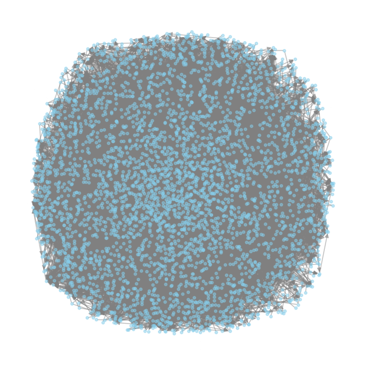
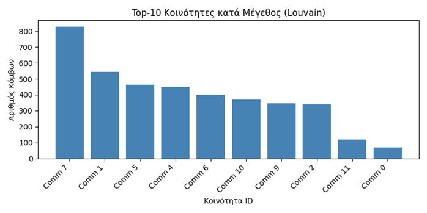
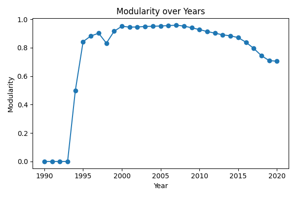

# Social Network Graph Analytics

A large-scale graph analytics project focused on structural analysis, ranking algorithms and community evolution in complex networks.

Developed as part of an MSc in Computer Science.

---

## Project Overview

This project explores two real-world network datasets:

1. Facebook ego-network dataset
2. OGBN-Arxiv citation network

The objective was to analyze structural properties, identify influential nodes, detect communities and study temporal community evolution.

---

## Core Capabilities

- Centrality analysis (Degree, Betweenness, Closeness, Eigenvector, PageRank)
- Snowball sampling for large-scale graph reduction
- Louvain community detection
- Dynamic community evolution tracking (Birth, Merge, Split, Survive, Death)
- Topic-Sensitive PageRank
- Modularity analysis
- NMI and Jaccard similarity evaluation

---

## Architecture

The repository is structured into modular analysis components:

- `facebook_analysis/` – Centralities and communities on social graph
- `citation_analysis/` – Sampling and ranking on citation network
- `dynamic_analysis/` – Community evolution & topic-sensitive ranking
- `report/` – Full project report

---

## Technical Stack

- Python
- NetworkX
- Louvain Community Detection
- Matplotlib
- Pandas
- Scikit-learn

---

## Key Highlights

- Implemented BFS-based snowball sampling to handle large citation graphs
- Designed event-based tracking for dynamic community transitions
- Compared global vs topic-sensitive ranking methods
- Evaluated structural modularity across time snapshots

---

## Demo Graphs

## Snowball-Sampled Citation Subgraph (~4K nodes)

## Community Size Distribution (Louvain)

## Modularity Evolution Over Time

---

## Engineering Focus

This project explores scalable graph analytics techniques applicable to:

- Influence modeling
- Ranking systems
- Community intelligence
- Knowledge graph evolution
- Recommender and discovery systems

The emphasis is on algorithmic efficiency, sampling strategies, and structural signal extraction from large-scale networks.
